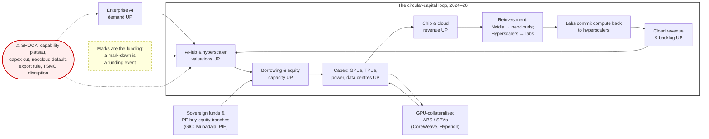

# Figure 3 — Circular capital fueling the AI build-out, 2026 (analogue of SAGA 2009 Figure 4)

Luis's 2009 note (SAGA Capital, May 18 2009) carried a loop diagram: cheap credit via securitisation → consumer spending → corporate profits → GDP & employment → disposable income → more securitisation (savings down). Issuance fell 98% from the 2006 peak when one asset class failed. This is the 2026 equivalent, after Qwen's critique of my 12-node draft (too many nodes, numbers in boxes, sub-loops): 7-node loop, numbers in the caption, sovereign funds and GPU-SPVs as the tranche buyers / SPVs, shock annotated outside.

**Caption.** *"Figure 3: Circular capital fueling the AI build-out, 2026. The loop: valuations → borrowing capacity → capex → chip/cloud revenue → reinvestment into labs and neoclouds → compute commitments back to hyperscalers → cloud revenue → valuations. Sovereign funds and PE buy the equity tranches (the 2005–07 hedge-fund role). GPU-collateralised SPVs (CoreWeave ~$35B debt; Meta Hyperion ~90% debt) are the structural equivalent of securitisation SPVs. Hyperscaler capex went from 9% debt-funded (FY24) to 32% (mid-2026); Alphabet raised $85B equity in June 2026; Amazon has committed ≤$25B and Google ≤$40B to Anthropic, which has committed >$100B to AWS, 1M TPUs, and ~$30B to Azure. Nvidia invests in and backstops neoclouds that buy its GPUs. A parallel loop (Microsoft → OpenAI, SoftBank/Oracle → Stargate) is omitted for clarity but has the same topology. The dashed annotation is the key insight: because labs are pre-profit and raise equity at marks, a mark-down is a funding event, not merely a paper loss. The red node lists the shock scenarios that would break the loop. Analogue of SAGA Capital, May 2009, Figure 4 ('Securitization fueling the world's economic growth')."*

My original draft (for the record) is in the scratch history of this session; the corrected one above is the one to use.
