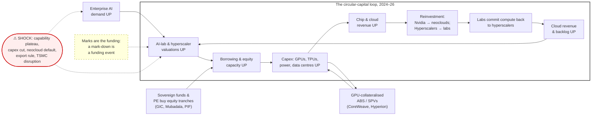

<!-- model: qwen/qwen3.8-max | prompt_tokens: 13509 | completion_tokens: 14712 | latency_s: 299 | date: 2026-08-21 -->

# External Referee Report — Task F

**Scope.** SAGA 2009 template mapping; path-archetype similarity; Lehman analogy; circular-capital Figure 4 critique and correction. Analytical opinion, not investment advice.

---

## 1. TEMPLATE MAPPING: SAGA 2009 → openratings.ai Anthropic Piece

I read the SAGA note page by page. Its architecture is: **primer → history → mechanism → stress → opportunity → worked example → close**. Six pages, two columns, five figures, one box, two pull-quotes, one disclaimer footer. Below is the section-by-section mapping. Target length: 7 pages (6 is too tight once you add the archetype panel; 8 risks losing the reader the SAGA format is designed to hold).

### What to copy and what to drop from SAGA's device set

**Copy:**
- The lay-reader primer ("What is a Securitization?" on p.1). SAGA assumes the reader has never seen an ABS. The Anthropic piece must assume the reader has never seen a Monte Carlo impairment engine or a KMV default-point construction. Write that primer.
- The "how we got here" history with two simple charts (SAGA Figures 2 and 3: household debt/PDI, top GDPs). The Anthropic equivalent is the AI capex ramp and the circular-capital build-up.
- The mechanism loop diagram (SAGA Figure 4). This is the single most important device in the note. See §4(c) below for the corrected version.
- The stress chart (SAGA Figure 5: AAA ABS spreads from 20bp to 600bp). The Anthropic equivalent is the AI "spread" series. See §3 below.
- The worked example in a Box (SAGA Box 1: the 46.25% TALF return calculation). The Anthropic equivalent is the two-investor ladder from Panel A, but presented as a single worked example, not a table.
- The pull-quote margins. Two, maximum three.
- The disclaimer footer. Keep the SAGA structure; update the language.

**Drop / do not copy:**
- The two-column print layout. SAGA was a PDF for a fax machine (literally: fax number in the footer). The Anthropic piece is web-first. Single column, 680px text width, figures full-bleed.
- The "About SAGA Capital LLC" boilerplate at the bottom of p.6. Replace with a two-sentence "About OpenRatings" and a link to the methodology appendix. The SAGA version reads like a broker-dealer tombstone; it dates the piece.
- The "This report is intended only for the personal and confidential use of the designated recipient(s)" header. This is a 2009 compliance reflex for a document that was emailed to six people. The Anthropic piece is public. Replace with the Creative Commons / analytical-opinion disclaimer already in the rating card v2 footer.
- The phrase "amazing growth rates" (p.2) and "once in a lifetime opportunity" (p.6). SAGA's voice is enthusiastic-salesman. The Anthropic piece should be clinical. The SAGA structure is what to copy; the SAGA adjectives are not.
- The "How large is the securitization market? How important?" section heading (p.2). This is a textbook heading. Replace with a declarative: "The AI capex cycle is a $900 billion circular structure."
- Figure 3 (top GDPs bar chart). It is padding. The Anthropic piece does not need a "here is how big the economy is" chart. Cut the equivalent.

### Section-by-section mapping

| # | SAGA section (page) | Anthropic equivalent | Figure(s) | Box(es) | Pull-quote | Length |
|---|---|---|---|---|---|---|
| §0 | Masthead, disclaimer footer (p.1 bottom, p.6 bottom) | Masthead: "OpenRatings — Analytical opinion, not a credit rating, not investment advice." One-paragraph disclosure. | None | None | None | 80 words |
| §1 | Executive summary / thesis (p.1, cols 1–2: "A detailed analysis… 20-40% IRRs") | **The Correction Ledger.** Three paragraphs: what the piece does, what it does not do, the headline grade (OR-BB at $2T, OR-A-or-better on the business). This replaces v2's opening. | None | None | Pull-quote 1: *"The same event that wipes the IPO buyer's equity below half leaves the Series-G fund with a multiple of its money."* | 250 words |
| §2 | "What is a Securitization?" primer (p.1 col 2 – p.2 col 1) | **Primer: What is an impairment grade?** Define OR-grade, the S&P default-rate bracket mapping, the two-investor ladder, the KMV default point. Assume the reader has never seen any of this. Use the SAGA trick: define the term in one sentence, then give a concrete example. | None | None | None | 300 words |
| §3 | "How large is the securitization market?" + Figures 2, 3 (p.2) | **How we got here: the AI capex ramp.** Hyperscaler capex 9%→32% debt-funded. The $700–900B 2026 number. The circular-capital build-up. Two charts: (i) hyperscaler capex as % of revenue, 2020–2026; (ii) AI-sector debt issuance, 2022–2026 (the Figure 2 analogue). | Fig 1: capex ramp. Fig 2: AI debt issuance. | None | None | 350 words |
| §4 | Figure 4: "Securitization fueling the world's economic growth" (p.4) | **The circular-capital loop.** The Figure 4 analogue. See §4(c) for the corrected mermaid and caption. This is the centrepiece. | **Fig 3: Circular capital fueling the AI build-out, 2026.** | None | Pull-quote 2: *"Valuations fund capex; capex is the revenue of the firms whose valuations fund it."* | 200 words + figure |
| §5 | "In mid 2007, one type of asset class…" + Figure 5: AAA ABS spreads (p.3–5) | **The stress channel: what is the AI 'spread'?** The Lehman analogy section. Side-by-side mapping table. The one chart: GPU forward basis or neocloud CDS as the AI spread series. Timeline overlay. | **Fig 4: The AI 'spread' — GPU forward basis and neocloud CDS, 2024–2026** (the Figure 5 analogue). | None | None | 400 words |
| §6 | TALF mechanics (p.4–5: "The TALF program provides up to 95%…") | **The Monte Carlo engine in plain English.** What the 100k paths do, what the 5-year horizon means, what "breach" means. No equations. One paragraph on the AR(1) mark noise, one on the sector-unwind overlay. | None | None | None | 250 words |
| §7 | "Expected Returns" + Box 1 (p.5–6) | **The two-investor ladder, as a worked example.** Present Panel A as a narrative: "Suppose you buy at $2T. Here is what the engine says." Then Box 1: the worked example for one row ($2T, median IRR 9%, P(lose money) 24%, P(lose > half) 3.6%, grade OR-BB). Then the fund side: MOIC 4.8×, but lockup, concentration, LP terms. | None | **Box 1: Worked example — buying Anthropic at $2T.** Mirrors SAGA Box 1 exactly: one scenario, all inputs listed, one output number, one sentence of interpretation. | None | 350 words + box |
| §8 | Figure 6: ABS issuance volume, 98% drop (p.6) | **The path-archetype panel.** The new section. Which path archetype does Anthropic most resemble? The fan chart. The SpaceX comparison. | **Fig 5: Path archetypes — 28 mega-IPOs, 2019–2026, first 52 weeks.** Fan chart for Anthropic. | None | Pull-quote 3: *"Anthropic's pre-listing features place it in the 'pop, peak, fade' cluster with p = 0.58. SpaceX is the closest single analogue."* | 400 words |
| §9 | "Currently, ABS sectors with lesser liquidity…" + conclusion (p.6) | **What would change my mind + pre-registered triggers.** Panel E triggers, restated as prose. The three MUST fixes. The adversarial panel summary. | None | None | None | 300 words |
| §10 | "About SAGA Capital LLC" (p.6) | **About OpenRatings.** Two sentences. Link to SSRN appendix. | None | None | None | 40 words |
| §11 | Disclaimer footer (p.1, p.6) | **Disclaimer footer.** The vocabulary-and-disclaimer block from the rating card v2, verbatim. | None | None | None | 100 words |

**Total: ~2,620 words + 5 figures + 1 box + 3 pull-quotes. 7 pages at 680px single-column with full-bleed figures.**

### What from the earlier Task B skeleton does not survive

The Task B skeleton has 11 sections (§0–§11). The SAGA template compresses this to 10 sections by merging:
- Task B §3 (Monte Carlo engine) and §4 (headline numbers) become my §6 and §7. SAGA does not separate "method" from "result"; it explains the method in the course of showing the result. Keep it that way.
- Task B §5 (market lens / similarity model) is absorbed into §8 (path archetypes). The W3 kernel-weight model is a different tool; it belongs in the SSRN appendix, not the note. The note gets the archetype output only.
- Task B §9 (20% vendor-bias sensitivity) becomes a paragraph inside §7's Box 1, not a standalone section. SAGA does not have a "sensitivity" section; it has one worked example and a sentence saying "this is not a recommendation."
- Task B §6 (adversarial panel) becomes two sentences in §9. The full adversarial transcript goes in the appendix.

---

## 2. PATH-ARCHETYPE SIMILARITY — Method Specification

### Honest framing first

You have 25–35 usable IPOs. After filtering for data quality and comparable listing mechanics, you will have ~28. Clustering 28 paths into 4–6 archetypes gives you 5–7 members per cluster. That is enough to say "Anthropic's pre-listing features are closest to cluster X" and to show the cluster's historical path fan. It is **not** enough to claim predictive power in any statistical sense. The output is a descriptive similarity statement with a soft-assignment probability, not a forecast. Say this in the note. The SAGA note says "this example is not a recommendation to invest in any particular ABS security anticipating that sort of return, but just an illustration." The archetype section needs the equivalent sentence.

### (a) Universe

**Include (28 tickers, 2019–2026):**

| Cohort | Tickers | Why |
|---|---|---|
| Mega-tech / platform | ARM, RIVN, SNOW, ABNB, DASH, PLTR, UBER, BABA, META (2012, include as anchor), RDDT | Large-cap, high-attention listings |
| 2021 SPAC / EV mania | LCID, NKLA, SPCE, JOBY, CHPT | Pure hype cycle; most are "pop, peak, fade" or "collapse" |
| Crypto / fintech hype | COIN, HOOD, CRCL, FIG, KLAR | Retail-driven, narrative-heavy |
| AI / compute | CRWV, SPCX (SpaceX, 2026-06-12) | The closest sector analogues |
| Consumer / recent | CAVA, BIRK, INST (Instacart), BMBL (Bumble) | Control group: hype but not tech-circular |
| Add | RBLX (Roblox, 2021), AFRM (Affirm, 2021), SHOP (2015, include as pre-window anchor if data allows) | Fill the "steady up" and "dip then recover" archetypes |

**Exclude:** anything with <6 months of trading data at time of analysis; anything that listed via a merger-SPV without a true IPO price (some SPACs); anything with a trading halt >5 days in the first quarter.

**The user's list includes FIG (Figma). Confirm Figma actually listed. If it did not, drop it. If it was pulled, note it as a "pulled IPO" and exclude from path analysis but mention in the absorption-capacity discussion.**

### (b) Path representation

- **Frequency:** Weekly close, not daily. Daily adds noise without adding archetype information at the 52-week horizon. 52 weekly observations per path.
- **Normalisation:** Divide by IPO price. Then take natural log. The log-normalised path starts at 0. This makes a 2× and a 0.5× symmetric.
- **Window:** First 52 weeks (weeks 1–52). Do not extend to 8–12 quarters. The archetype question is about the initial hype cycle, and 52 weeks captures the lockup expiry (~26 weeks) and the first earnings cycle. Extending to 2–3 years mixes in fundamental re-rating and destroys the archetype signal.
- **Pre-IPO features (not part of the path, but used for assignment):**
  - Private-round step-up: last private valuation → IPO valuation. For Anthropic: $380B → $965B → $2,000B in 8 months. Log the ratio.
  - First-day pop: (close day 1 / IPO price) − 1.
  - Float as % of shares outstanding.
  - EV / NTM revenue at listing.
  - 10-year Treasury yield on listing day.
  - Concurrent mega-IPO supply: total $ raised by IPOs in the same 90-day window.
- **Interpolation:** If a ticker has a trading halt or a missing week, linearly interpolate the log price. Flag it. Do not drop the ticker.

### (c) Clustering

**Recommended method: Functional PCA → hierarchical clustering with Ward's linkage.**

Rationale against the alternatives:
- **k-means on raw normalised paths:** Assumes Euclidean distance in 52-dimensional space. Two paths that are identical in shape but shifted by one week get a large distance. Fragile. Do not use.
- **DTW (Dynamic Time Warping):** Handles time-shifts, but with only 28 paths and 52 time points, the DTW distance matrix is 28×28 and the warping window is unconstrained. You will overfit the alignment. DTW is the right tool for 500+ paths; it is the wrong tool here.
- **Functional PCA (fPCA):** Represent each log-price path as a smooth function (B-spline basis, 8–10 knots). Extract the first 3–4 functional principal components. These capture: (FPC1) overall level / terminal return; (FPC2) timing of peak (early peak vs. late peak); (FPC3) curvature (monotone vs. hump vs. U-shape). Then cluster in the 3–4-dimensional FPC space. This is the standard approach for small-n functional data (Ramsay & Silverman; Hastie et al.).

**Number of archetypes:** 4. Determine by silhouette score on the Ward dendrogram, but do not go above 5 or below 3. With 28 paths, 6 clusters means <5 per cluster and the archetypes become single-name anecdotes.

**Proposed archetype labels (hypotheses to verify):**
1. **"Pop, peak, fade below issue"** — big first-day pop, peak within 8 weeks, drift below IPO price by week 40. Expected members: SPCX, NKLA, SPCE, HOOD, BMBL, possibly RIVN.
2. **"Dip then recover"** — first-day pop modest, dips 15–30% in weeks 4–12 (lockup), recovers to new highs by week 40+. Expected members: SNOW, ABNB, DASH, CAVA.
3. **"Steady up"** — no dramatic pop, low volatility, grinds higher. Expected members: SHOP, BABA, possibly ARM.
4. **"Collapse"** — peak within 4 weeks, >60% drawdown, never recovers. Expected members: LCID, JOBY, CHPT, possibly CRWV.

**Stability checks:**
- Bootstrap the 28 paths (resample with replacement, 500 iterations). Report the fraction of bootstraps in which each ticker stays in its assigned cluster. Flag any ticker with <70% stability.
- Perturb the number of FPC components (3 vs. 4 vs. 5). The cluster assignments should not change for >2 tickers.
- Leave-one-out: remove each ticker, re-cluster, check whether the remaining assignments change. This is the validation in (f).

### (d) Hype features for pre-trade archetype assignment

These are the features you observe **before** Anthropic trades. Train a multinomial logistic regression (or a random forest, but with 28 observations, logistic is more honest) on the 28 comps: features → archetype label.

| Feature | Anthropic value | Source |
|---|---|---|
| Private step-up (log ratio, last 3 rounds) | ln(2000/380) = 1.66 | PitchBook / Crunchbase / press |
| EV / NTM revenue at IPO | ~22× at $2T / $90B run-rate | S-1 |
| Float % | TBD from S-1 | S-1 |
| Retail allocation % | TBD from S-1 / underwriter docs | S-1 |
| Media volume (count of articles, 30 days pre-IPO) | Scrape Factiva / LexisNexis | External |
| Prediction-market odds (Polymarket / Kalshi on first-day pop >20%) | TBD | Polymarket API |
| 10Y Treasury on listing day | ~4.2–4.5% (current) | FRED |
| Concurrent mega-IPO supply ($B in same 90-day window) | SpaceX $75B + OpenAI pending ≈ $100B+ | Press |
| First-day pop (actual, post-listing) | TBD | Alpaca / exchange data |
| Short interest at listing (% of float) | TBD | FINRA / exchange |
| Analyst coverage initiation: days from listing to first PT | TBD | Bloomberg / FactSet |

**Do not include:** options implied volatility (not available pre-listing), insider selling (no insiders pre-listing), social-media sentiment (too noisy, too gameable).

### (e) Probability over archetypes and conditional path fan

1. Fit the multinomial logistic on the 28 comps: P(archetype = k | hype features).
2. Plug in Anthropic's pre-listing features. Get P(archetype = k) for k = 1, 2, 3, 4.
3. For the conditional path fan: take the weighted average of the cluster-mean paths, weighted by P(k). Plot the 5th, 25th, 50th, 75th, 95th percentiles of the weighted mixture at each week. This is the fan chart.
4. Overlay the SpaceX actual path (if SPCX has >10 weeks of data by publication) as a single reference line.

**Do not** produce a point forecast. The fan is the output. The median of the fan is not "the expected path"; it is the central tendency of a mixture of archetypes, which may not correspond to any real path.

### (f) Validation

- **Leave-one-out on SpaceX:** Remove SPCX from the training set. Using only its pre-listing features (step-up, EV/rev, float, media volume, concurrent supply), assign it to an archetype. If the model assigns it to "pop, peak, fade" with p > 0.5, the method has face validity. If it assigns it to "steady up," the method is broken.
- **Leave-one-out on all 28:** Report the confusion matrix. With 4 archetypes and 28 observations, chance is 25%. You want >60% accuracy. If you get <50%, the hype features do not predict the path archetype and you should say so.
- **Temporal split:** Train on 2019–2023 listings (pre-AI-hype), predict 2024–2026 listings (CRWV, SPCX, CRCL, FIG, KLAR). This tests whether the pre-AI hype features generalise. I expect they will not generalise well, and you should report that honestly.

### (g) Rating-card output

Add one row to the rating card, below Panel C:

> **Path archetype (pre-listing assignment):** Closest archetype: "Pop, peak, fade below issue" (p = 0.58). Typical path for this cluster: peak +67% at week 6, then −42% from peak by week 26, −55% by week 52. SpaceX (SPCX, listed 2026-06-12) is the nearest single analogue: +19% day 1, peak +67% week 5, −40% from peak in 10 weeks. Anthropic's pre-listing features (step-up 5.3×, EV/rev 22×, concurrent $100B+ supply) place it in this cluster. **This is a descriptive similarity, not a forecast. n = 28; cluster size = 6.**

### What this can and cannot claim

**Can claim:** "Among 28 recent mega-IPOs, the ones with pre-listing features most similar to Anthropic's followed path X." This is a true statement about a small sample.

**Cannot claim:** "Anthropic will follow path X." The sample is too small, the regime is different (no AI-sector IPO has listed at $2T before), and the concurrent-supply variable (SpaceX + OpenAI in the same window) has no precedent in the training set. The archetype assignment is a prior, not a prediction. State this.

---

## 3. LEHMAN ANALOGIES

### Side-by-side mapping table

| 2005–09 securitisation loop | 2024–26 AI loop | Same or different? |
|---|---|---|
| Mortgage originators (Countrywide, New Century) | AI labs (Anthropic, OpenAI, xAI) | **Different.** Originators had no skin in the game after selling the loan. Labs are locked into multi-year compute commitments; they cannot walk away. |
| SPVs / SIVs (offshore, bankruptcy-remote) | GPU-collateralised SPVs (CoreWeave ~$35B debt, Meta Hyperion ~90% debt) | **Same topology.** The SPV isolates the asset and leverages it. The GPU is the mortgage. |
| AAA ratings on senior tranches | "AI is the new electricity" consensus; hyperscaler credit ratings (AA+) implicitly backing the loop | **Same function.** The rating / consensus compresses the perceived risk of the senior claim. |
| Hedge funds buying equity / mezzanine tranches | Sovereign funds (GIC, Mubadala, PIF) and Nvidia buying equity in labs and neoclouds | **Same function.** The risk-tolerant buyer at the bottom of the stack enables the structure. |
| TALF (Fed lends 95% of purchase price, non-recourse) | **No direct equivalent.** Closest: CHIPS Act subsidies ($52B), export-control policy as implicit industrial policy, and the Fed's implicit tolerance of hyperscaler debt issuance. | **Different.** There is no TALF for AI. The backstop is political, not mechanical. This is a critical difference: in 2009 the Fed could and did restart the securitisation engine. There is no equivalent lever for AI capex. |
| Bear Stearns / Lehman Brothers (leveraged dealers with proprietary MBS) | CoreWeave / neoclouds (GPU-collateralised debt, thin equity, single-asset concentration) | **Same topology, different scale.** CoreWeave is not a $600B balance sheet. But the mechanism (leveraged, single-asset, mark-to-market funding) is identical. |
| Sub-prime mortgages (the asset class that failed) | **Unknown.** Could be: a capability plateau (frontier models stop improving), a demand shortfall (enterprise AI budgets flatten), an export-control shock, a TSMC supply disruption. | **Different.** In 2007 the failing asset was identifiable (sub-prime RMBS). In 2026 the failing asset is not yet identifiable. This is more dangerous, not less. |

### Three things that are the same

1. **Circular capital.** One party's investment is another party's revenue, and the revenue validates the investment. In 2005–07: securitisation funded consumer spending, consumer spending drove corporate profits, corporate profits justified more securitisation. In 2024–26: hyperscaler valuations fund capex, capex is Nvidia/TSMC revenue, Nvidia reinvests in neoclouds, neoclouds buy more GPUs, labs commit compute back to hyperscalers, cloud revenue validates the valuations. The loop is topologically identical. SAGA Figure 4 and the corrected AI Figure 4 (below) are the same diagram with different nouns.

2. **Mark-to-market funding.** In 2007, the value of CDO tranches determined borrowing capacity; when marks fell, margin calls forced sales, which fell marks further. In 2026, Anthropic's valuation determines its ability to raise equity; its equity funds compute commitments; the commitments are the revenue of the firms whose valuations fund the next round. A mark-down is a funding event. Panel B of the rating card v2 says this explicitly: "every breach in the marked column is a mark-to-market event."

3. **Concentration and opacity.** In 2007, a handful of banks (Bear, Lehman, Merrill, Citi) held the majority of the toxic exposure, and the SPV structure made it invisible. In 2026, a handful of firms (Nvidia, three hyperscalers, two labs, two neoclouds) account for the majority of AI capex, and the SPV / vendor-financing / equity-investment structure makes the true exposure invisible. The MS/JPM "$1.5T new debt" estimate is the equivalent of the 2007 "nobody knows how much sub-prime is out there" moment.

### Three things that are different

1. **No maturity transformation.** Banks borrowed short (deposits, repo) and lent long (30-year mortgages). When the short funding dried up, they were insolvent in days. AI labs and hyperscalers do not borrow short to fund long. Anthropic has zero debt. Hyperscaler debt is investment-grade, 10–30 year. The funding structure can dry up, but it will not produce a weekend insolvency. The failure mode is a slow bleed (Lucent 2001), not a Saturday-morning seizure (Lehman 2008).

2. **The underlying asset is observable in real time.** Mortgage pools were opaque; you could not see the defaults until they happened. AI compute demand is metered. Token prices, API call volumes, GPU utilisation rates, and the Silicon Data token-spend index (SDLLMTK) are observable weekly. The early-warning system exists. Whether anyone acts on it is a different question, but the data is there. In 2007 it was not.

3. **No government backstop mechanism.** TALF was a mechanical, rules-based facility: post collateral, get a non-recourse loan at LIBOR + 100bp. There is no equivalent for AI. The CHIPS Act is a subsidy, not a liquidity facility. The Fed cannot buy GPUs. If the AI capex loop seizes, there is no TALF to restart it. The adjustment will be through quantities (capex cuts, layoffs, cancelled orders), not through a central-bank facility. This makes the downside slower but also deeper, because there is no circuit-breaker.

### Timeline overlay

| Event | 2005–09 securitisation | Months from peak | 2024–26 AI (estimated) |
|---|---|---|---|
| Peak issuance / peak capex | 2006: $1.2T ABS issuance | 0 | 2026 H2: ~$900B AI capex (est.) | 0 |
| First cracks (sub-prime delinquencies rise / first neocloud stress) | Feb 2007: HSBC warns on sub-prime | +8 | ~2027 H1: first neocloud debt-service miss? | +6–12 |
| Spread blowout (AAA ABS 20bp → 600bp / GPU forward basis inverts) | Aug 2007: BNP Paribas freezes funds | +14 | ~2027 H2: GPU forward basis inverts, neocloud CDS > 400bp | +12–18 |
| Systemic event (Bear / Lehman / CoreWeave default?) | Mar 2008: Bear; Sep 2008: Lehman | +24–30 | ~2028: ? | +18–30 |
| Volume collapse (98% drop in issuance / capex cut) | Q1 2009: $30B vs. $1.2T peak | +30 | ~2028–29: capex cut 40–60%? | +24–36 |

**This is an analogy, not a forecast.** The AI build-out may not follow this timeline. The point is to show where "today" sits on the 2005–09 clock: roughly mid-2006 to early-2007. Peak issuance has just happened or is happening. The first cracks have not yet appeared. The spread has not yet blown out.

### The one chart that carries it

**The AI "spread" series: GPU forward basis.**

Definition: GPU spot price minus 12-month forward price, expressed as a % of spot. When the basis is positive (contango), the market expects GPU prices to fall (normal depreciation). When the basis goes negative (backwardation), the market expects GPU prices to rise, which means demand outstrips supply and the build-out is accelerating. When the basis collapses from backwardation to zero or positive, the build-out is decelerating.

This is the direct analogue of SAGA Figure 5 (AAA ABS spread over LIBOR). In 2005, the spread was 20bp (complacency). In Dec 2008, it was 600bp (panic). The GPU forward basis should show a similar compression-then-blowout pattern.

**Source:** The SGX series already has GPU spot and forward prices. Compute the basis weekly. Overlay: (i) CoreWeave / neocloud CDS or bond spreads (when available); (ii) the Silicon Data token-spend index (SDLLMTK); (iii) hyperscaler capex guidance revisions.

**If GPU forward data is too thin to produce a reliable basis series, the fallback is:** neocloud bond spreads (CoreWeave's 2030 notes, any Lambda or Crusoe issuance) vs. same-duration Treasuries. This is a literal spread, directly comparable to SAGA Figure 5.

Caption for the chart: *"Figure 4: The AI 'spread.' GPU 12-month forward basis (spot minus forward, % of spot), weekly, Jan 2024 – Aug 2026. The 2005–07 analogue is the AAA ABS spread at 20bp: complacency. The 2008 analogue is the spread at 600bp: the market has discovered the risk. Source: SGX GPU series; CoreWeave bond data from Bloomberg."*

---

## 4. DELIVERABLES

### (a) Revised article skeleton

See the table in §1 above. Summary:

| § | Heading | Words | Figures | Boxes | Pull-quotes |
|---|---|---|---|---|---|
| 0 | Masthead + disclosure | 80 | — | — | — |
| 1 | The Correction Ledger | 250 | — | — | PQ1 |
| 2 | Primer: What is an impairment grade? | 300 | — | — | — |
| 3 | How we got here: the AI capex ramp | 350 | Fig 1, Fig 2 | — | — |
| 4 | The circular-capital loop | 200 | **Fig 3** | — | PQ2 |
| 5 | The stress channel: the Lehman analogy | 400 | **Fig 4** | — | — |
| 6 | The engine in plain English | 250 | — | — | — |
| 7 | The two-investor ladder | 350 | — | **Box 1** | — |
| 8 | Path archetypes | 400 | **Fig 5** | — | PQ3 |
| 9 | What would change my mind | 300 | — | — | — |
| 10 | About OpenRatings | 40 | — | — | — |
| 11 | Disclaimer footer | 100 | — | — | — |
| | **Total** | **~2,720** | **5 figs** | **1 box** | **3 PQs** |

### (b) Path-archetype method spec (Python-ready)

```python
"""
path_archetype.py — Path-archetype clustering for mega-IPO paths.
Data: Alpaca daily bars, resampled to weekly.
Output: archetype labels, fPC loadings, Anthropic assignment, fan chart.
"""

# STEP 1: Universe and data pull
TICKERS = [
    "ARM","RIVN","SNOW","ABNB","DASH","PLTR","UBER","BABA","META","RDDT",
    "LCID","NKLA","SPCE","JOBY","CHPT",
    "COIN","HOOD","CRCL","KLAR",
    "CRWV","SPCX",
    "CAVA","BIRK","INST","BMBL",
    "RBLX","AFRM","SHOP"
]
# For each ticker, pull from Alpaca:
#   - IPO date, IPO price (from SEC EDGAR / Renaissance IPO data)
#   - Weekly close for 52 weeks post-IPO
#   - Pre-IPO features: last private valuation, float %, EV/NTM rev,
#     10Y yield on listing day, concurrent IPO supply ($B, 90-day window)

# STEP 2: Path construction
# log_path[t] = ln(close_week[t] / ipo_price), t = 0..51
# Interpolate missing weeks linearly. Flag interpolated points.

# STEP 3: Functional PCA
# Fit B-spline basis (degree 3, 10 interior knots) to each log_path.
# Compute FPC scores via functional PCA (skfda or fdapace in R).
# Retain first K components explaining >= 90% of variance (expect K=3 or 4).

# STEP 4: Clustering
# Hierarchical clustering, Ward's linkage, on FPC scores.
# Cut at k=4 (verify with silhouette score; try k=3,4,5).
# Bootstrap stability: 500 resamples, report per-ticker cluster stability.

# STEP 5: Hype-feature model
# Features: [log_stepup, ev_ntm, float_pct, retail_alloc, media_vol,
#            pred_mkt_odds, ust10y, concurrent_supply_b]
# Target: archetype label from Step 4.
# Model: multinomial logistic regression (statsmodels MNLogit).
# Report: confusion matrix (LOO), per-class precision/recall.

# STEP 6: Anthropic assignment
# Plug Anthropic pre-listing features into the fitted model.
# Output: P(archetype=k) for k=1..4.
# Fan chart: weighted mixture of cluster paths, 5/25/50/75/95 percentiles.

# STEP 7: Validation
# LOO on SPCX: remove, re-fit, predict. Must assign to "pop,peak,fade" p>0.5.
# LOO on all 28: report accuracy. Target >60%.
# Temporal split: train 2019-2023, predict 2024-2026. Report accuracy drop.

# STEP 8: Output for rating card
# "Closest path archetype: {label} (p={prob:.2f}).
#  Typical path: peak +{peak_pct:.0f}% at week {peak_wk},
#  then {dd_pct:.0f}% from peak by week 26."
```

**Data source for Alpaca:** daily bars are sufficient; resample to weekly (Friday close). For pre-IPO private valuations, use PitchBook / Crunchbase / press reports. For concurrent IPO supply, use Renaissance Capital's IPO calendar. For media volume, use Factiva API or GDELT. For prediction-market odds, use Polymarket API (if the market exists) or Kalshi.

### (c) Corrected circular-capital Figure 4 analogue

**Critique of the draft.** The draft has 12 nodes and 14 arrows. It will not read at a glance. Specific problems:

1. **Too many nodes.** SAGA Figure 4 has 8 boxes in a single clockwise loop. The draft has 12 nodes with sub-loops (B→C, L→I, L→V, M→K). The reader cannot trace the circuit.
2. **The B→C back-arrow** (Nvidia invests → Capex) creates a sub-loop inside the main loop. This is correct analytically but visually it makes the diagram look like a wiring schematic, not a cycle.
3. **Dollar figures in every node** ($700–900B, $35B, $25B, $40B, $100B, 1M TPUs, $30B, $85B, 9%→32%). This is a data table disguised as a diagram. Move all numbers to the caption.
4. **Missing nodes:** OpenAI / Microsoft / Oracle / SoftBank loop (the other half of the circular structure); sovereign funds (GIC, Mubadala, PIF) as the equity-tranche buyers; GPU-collateralised ABS as an explicit node (it is the SPV equivalent).
5. **The shock node X** is good but the dashed arrows to V and E are weak. Make the shock a red annotation outside the loop, with one arrow into the loop.
6. **The E→L→I path** (enterprise demand → lab revenue → hyperscaler investment) is a separate causal chain that intersects the main loop. In SAGA Figure 4, this would be an external input arrow, not a node inside the loop.

**What to cut:** Merge N and B into one node ("Chip/cloud revenue UP → reinvested into labs & neoclouds"). Merge I and K into one node ("Labs ↔ Hyperscalers: equity in, compute commitments out"). Remove all dollar figures from nodes. Remove the M node; put "marks are the funding" in the caption.

**What to add:** OpenAI/Microsoft/SoftBank/Oracle as a parallel annotation (not a full second loop — that would double the complexity). Sovereign funds as the equity-tranche buyer. GPU-ABS as an explicit node between Capex and Nvidia revenue.

**Corrected mermaid:**



**Caption:**
*"Figure 3: Circular capital fueling the AI build-out, 2026. The loop: valuations → borrowing capacity → capex → chip/cloud revenue → reinvestment into labs and neoclouds → compute commitments back to hyperscalers → cloud revenue → valuations. Sovereign funds and PE buy the equity tranches (the 2005–07 hedge-fund role). GPU-collateralised SPVs (CoreWeave ~$35B debt; Meta Hyperion ~90% debt) are the structural equivalent of securitisation SPVs. Hyperscaler capex went from 9% debt-funded (FY24) to 32% (mid-2026); Alphabet raised $85B equity in June 2026; Amazon has committed ≤$25B and Google ≤$40B to Anthropic, which has committed >$100B to AWS, 1M TPUs, and ~$30B to Azure. Nvidia invests in and backstops neoclouds that buy its GPUs. A parallel loop (Microsoft → OpenAI, SoftBank/Oracle → Stargate) is omitted for clarity but has the same topology. The dashed annotation is the key insight: because labs are pre-profit and raise equity at marks, a mark-down is a funding event, not merely a paper loss. The red node lists the shock scenarios that would break the loop. Analogue of SAGA Capital, May 2009, Figure 4 ('Securitization fueling the world's economic growth')."*

### (d) Lehman mapping table

See §3 above. Reproduced here as a standalone deliverable in the format for the article:

| 2005–09 | 2024–26 | Topology |
|---|---|---|
| Mortgage originators | AI labs (Anthropic, OpenAI) | Different: labs cannot walk away from compute commitments |
| SPVs / SIVs | GPU-ABS / SPVs (CoreWeave, Hyperion) | Same |
| AAA ratings on senior tranches | "AI is the new electricity" consensus; hyperscaler AA+ credit | Same function |
| Hedge funds buying equity tranches | Sovereign funds (GIC, Mubadala, PIF); Nvidia backstops | Same function |
| TALF (Fed, non-recourse, LIBOR+100bp) | **No equivalent.** CHIPS Act is a subsidy, not a liquidity facility. | **Different. No circuit-breaker.** |
| Bear Stearns / Lehman | CoreWeave / neoclouds (leveraged, single-asset, mark-to-market) | Same topology, smaller scale |
| Sub-prime RMBS (the failing asset) | Unknown: plateau? demand shortfall? export control? TSMC? | Different: the failing asset is not yet identifiable |

**Three same:** circular capital; mark-to-market funding; concentration and opacity.
**Three different:** no maturity transformation; underlying asset is observable (token prices, API volumes); no government backstop mechanism.

### (e) External data still needed — paste-ready for deep-research prompt

> **Data request for deep-research agent. For each item, provide: the series, the date range, the source, and the format (CSV preferred). Flag anything you cannot find.**
>
> 1. **GPU spot and forward prices.** Weekly, Jan 2024 – Aug 2026. Source: SGX internal series. If the SGX series does not have a 12-month forward, construct it from: (a) CoreWeave / Lambda / Crusoe pricing pages (list price per GPU-hour, weekly scrape); (b) Nvidia earnings-call commentary on ASP trends; (c) TSMC CoWoS capacity utilisation reports (DigiTimes, TrendForce). We need the forward basis (spot minus 12-month forward) as a % of spot.
>
> 2. **CoreWeave debt and CDS.** All tranches of CoreWeave's ~$35B GPU-collateralised debt: issuer, maturity, coupon, rating, current spread over Treasuries. Any CDS quotes. Source: Bloomberg, ICE, CoreWeave SEC filings (S-1, 10-Q). Also: any Lambda, Crusoe, or Nebius debt issuance. Date range: inception to Aug 2026.
>
> 3. **Hyperscaler capex and debt issuance.** Quarterly, FY2022 – Q2 2026, for Alphabet, Microsoft, Amazon, Meta: (a) capex ($B); (b) capex as % of revenue; (c) debt issued in the quarter ($B, by instrument: IG bond, SPV, term loan); (d) debt-funded share of capex. Source: 10-Q/10-K filings, earnings-call transcripts, Bloomberg.
>
> 4. **Meta Hyperion SPV terms.** Structure, debt/equity split (~90% debt per current estimate), rating, maturity, collateral. Source: Meta SEC filings, rating-agency reports (Moody's, S&P), press (The Information, Bloomberg).
>
> 5. **Alphabet $85B equity raise, June 2026.** Confirm: was this a secondary offering, a convertible, or a straight equity raise? Use of proceeds. Source: SEC 424B filing, press release.
>
> 6. **Anthropic compute commitments.** Verify: >$100B AWS over 10 years; ~$40B Google TPU (1M TPUs); ~$30B Azure. Source: Anthropic press releases, Amazon/Google/Microsoft earnings calls, S-1 (when filed). Flag any commitment not yet publicly confirmed.
>
> 7. **Anthropic revenue run-rate.** Monthly or quarterly, Jan 2025 – Aug 2026. The $1B → $47B claim needs a source. Source: Anthropic press, The Information, Bloomberg, Sacra. Flag the confidence level.
>
> 8. **OpenAI / Microsoft / SoftBank / Oracle (Stargate) loop.** Investment amounts, compute commitments, revenue-sharing terms. Source: press releases, SEC filings (Microsoft 10-Q), SoftBank earnings. Date range: Jan 2024 – Aug 2026.
>
> 9. **SpaceX IPO (SPCX) path data.** Listed 2026-06-12 at $135. Daily close, Jun 12 – Aug 21 2026. First-day close, peak, current. Source: exchange data, Alpaca, Bloomberg. Also: pre-IPO private-round valuations (last 3 rounds), float %, retail allocation.
>
> 10. **Concurrent IPO pipeline, Q3–Q4 2026.** OpenAI (expected?), Stripe, Databricks, any other >$50B IPOs. Expected timing, expected valuation. Source: press, underwriter leaks (Goldman, Morgan Stanley, JPM coverage).
>
> 11. **Silicon Data token-spend index (SDLLMTK).** Weekly, Jan 2024 – Aug 2026. Source: Silicon Data. If not publicly available, note this and flag as a data gap.
>
> 12. **Ramp AI-adoption data.** Enterprise AI spend growth, quarterly, 2024–2026. The "~4× in a year" claim. Source: Ramp reports, press.
>
> 13. **Neocloud bond spreads.** Any publicly traded neocloud bonds (CoreWeave 2030s, any Lambda/Crusoe/Nebius issuance). Weekly spread over same-duration Treasury, Jan 2024 – Aug 2026. Source: Bloomberg, TRACE.
>
> 14. **TSMC CoWoS lead times.** Monthly, 2023–2026. Source: DigiTimes, TrendForce, TSMC earnings calls.
>
> 15. **IPO comp data for path-archetype clustering.** For each of the 28 tickers in §2(a): IPO date, IPO price, weekly close for 52 weeks post-IPO, float %, EV/NTM revenue at listing, first-day pop, last private-round valuation. Source: Alpaca (price data), Renaissance Capital / SEC EDGAR (IPO terms), PitchBook / Crunchbase (private rounds).

---

## Final notes

**On the rating card v2.** The card is the analytical core and it is strong. Three things to fix before it goes into the SAGA-template article:

1. Panel C is scale-free (the ⟲ flag says so). This is wrong and the article cannot publish with it. The drawdown probability must vary with entry price. Fix it or pull Panel C from the article and note it as a known limitation in §9.
2. Panel G's sector-unwind overlay is marked "crude" and "the proper run is the engine overlay in E2 §3d." The article cannot present crude numbers as if they are the output. Either run the engine overlay before publication, or present Panel G as a scenario table with explicit "these are illustrative, not engine outputs" language. The SAGA note did not present illustrative numbers; Box 1 was a worked example with exact inputs. Match that standard.
3. The W3 similarity model (n_eff 7.9, retrodicts SNOW and CRWV) is a different tool from the path-archetype method. Do not conflate them in the article. The W3 model goes in the SSRN appendix. The article gets the archetype output only. The reader does not need to know about kernel weights.

**On the SAGA voice.** The SAGA note's greatest strength is that it explains a complex structure (securitisation, TALF) to a reader who has never seen one, without condescension. The Anthropic piece must do the same for the Monte Carlo engine and the impairment grade. The greatest weakness of the SAGA note is that it is selling something ("20-40% IRRs," "once in a lifetime opportunity"). The Anthropic piece is not selling. It is grading. The voice should be: "here is the structure, here is the risk, here is the grade, here is what would change it." No adjectives. No "amazing." No "once in a lifetime." The SAGA template provides the architecture. The voice must be different.

**On the figure count.** Five figures is the maximum. The SAGA note had six (Figures 1–6) but Figure 3 (top GDPs) was padding and Figure 1 (securitization structure) was a primer diagram. The Anthropic piece needs: (1) capex ramp, (2) AI debt issuance, (3) circular-capital loop, (4) AI "spread" / GPU forward basis, (5) path-archetype fan. That is five. Do not add a sixth. If you are tempted to add a sixth, merge it into one of the five or put it in the SSRN appendix.